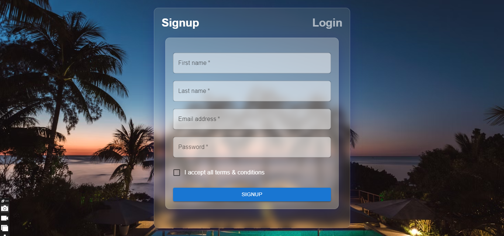
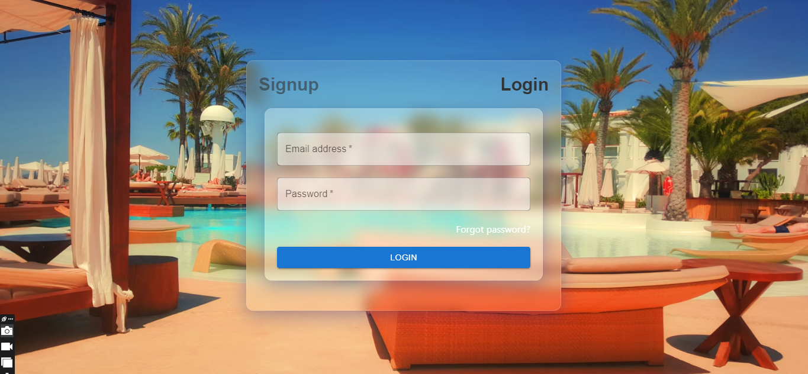
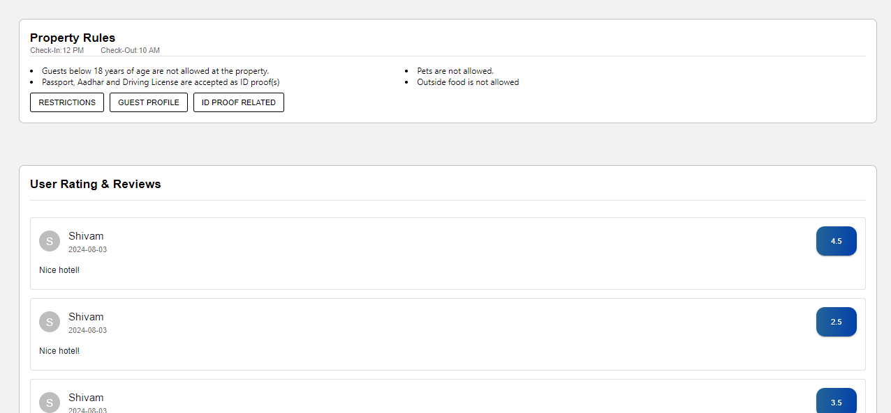

# book-my-trip-app
Book My Trip Application - Modern Microservice Based Application Using Java, Spring Boot, React, Docker, Kubernetes, SQL


# Book My Trip App

Welcome to the Book My Trip App project! This project is designed to teach students and working professionals how to build and understand a microservice architecture using a book my trip system as an example.

# Book My Trip Screenshots







## Project Structure

The main directory structure is as follows:

- **backend**: Contains all the backend microservices.
  - **discovery-service**: Manages service discovery for other microservices.
  - **edge-service**: Acts as the API gateway for routing requests to appropriate services.
- **frontend**: Contains the React JS based frontend for the book my trip application.
- **db**: Contains SQL scripts to initialize the database with sample data.

## Backend Services

### Discovery Service
- **Description**: The discovery service is responsible for registering and discovering other microservices in the architecture. It uses Eureka for service registration and discovery.
- **Technologies**: Spring Boot, Netflix Eureka

### Edge Service
- **Description**: The edge service acts as the API gateway, routing external requests to the appropriate microservice. It also handles authentication and authorization.
- **Technologies**: Spring Boot, Spring Cloud Gateway

## Frontend

### React JS Application
- **Description**: The frontend is built using React JS. It interacts with the backend microservices to provide a seamless user experience for book my trip.
- **Technologies**: React JS, Redux, Axios

## Database

### SQL Scripts
- **Description**: The `db` folder contains SQL scripts to initialize the database with sample data. This helps in setting up the initial state of the application.
- **Technologies**: MySQL/PostgreSQL

## Getting Started

### Prerequisites
- Java 8 or higher
- Node.js
- Docker (for future steps)
- Kubernetes (for future steps)

### Installation

- **Clone the Repository**
   ```bash
   git clone https://github.com/yourusername/book-my-trip-app.git
   cd book-my-trip-app

### Local Setup

- **Backend Setup**
   - Navigate to the `backend` directory.
   - For each service (discovery-service, edge-service), run the following commands:
     ```bash
     cd <service-directory>
     ./mvnw clean install
     ./mvnw spring-boot:run
     ```

- **Frontend Setup**
   - Navigate to the `frontend` directory.
   - Install dependencies and start the development server:
     ```bash
     npm install
     npm start
     ```

- **Database Setup**
   - Navigate to the `db` directory.
   - Execute the SQL scripts to initialize your database with sample data.

### Running the Application

- After setting up the backend services and the frontend, open your browser and navigate to `http://localhost:3000` to see the application in action.

## Future Enhancements

- **Dockerization**: We plan to dockerize the entire application to make deployment easier.
- **Kubernetes**: We will configure Kubernetes to demonstrate how to deploy and manage microservices in a cluster.

## Contribution

We welcome contributions from the community! If you'd like to contribute, please fork the repository and submit a pull request. For major changes, please open an issue first to discuss what you would like to change.

### Contribution Guidelines

- Fork the repository.
- Create a new branch for your feature or bugfix.
- Commit your changes with clear commit messages.
- Push your changes to the branch.
- Open a pull request.

## License

This project is licensed under the Apache-2.0 License. See the `LICENSE` file for details.

## Acknowledgments

- This project is inspired by the need to teach microservices in an easy and practical way.

---

Feel free to reach out with any questions or suggestions. Happy coding!
